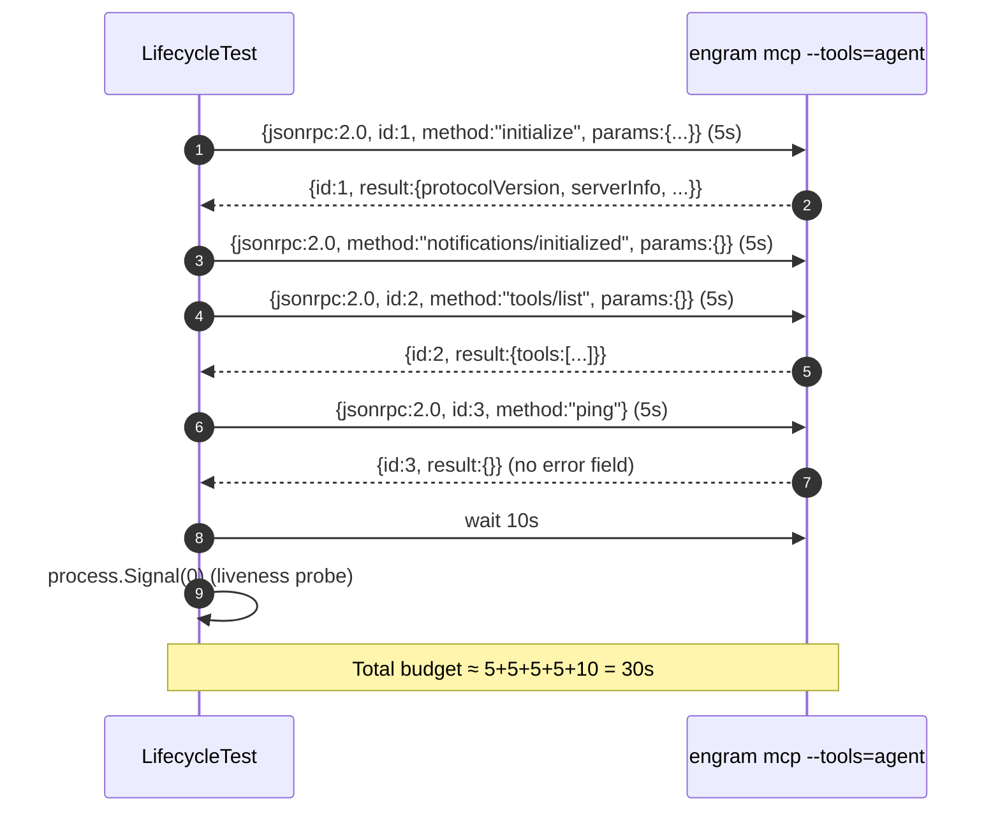

# Design: Engram MCP Doctor + Lifecycle Hardening

## Context & Forces

Issue `Gentleman-Programming/gentle-ai#1019` (GinoL221, 2026-07-05) reports Claude Code
SIGINTing the Engram MCP server after 2-5s. The most likely cause is the Engram
binary's MCP server implementation, not gentle-ai's registration, but the
proposal (`openspec/changes/feat-engram-mcp-doctor-lifecycle/proposal.md:5`)
locks the gentle-ai side to **evidence + diagnosis**, never a behavioural
fix.

| Force | Resolution |
|---|---|
| Don't ship behaviour fix in this repo | New `CheckEngramMCPVersion` is a read-only doctor check; no inject path is modified. |
| `verify.go:31-37` runs `engram version` (NOT `engram --version`) | Reuse `VerifyVersionCommand` directly; do NOT add a parallel flag-based probe. |
| Registration shape must not drift | `internal/components/engram/inject.go:85-91` and `:798-828` are read-only references; design forbids edits. |
| Default test suite must stay clean | Build tag `engram_lifecycle`; `go test ./...` compiles the file out. |
| Threshold value is unknown | Constant ships at `"0.0.0"` with a TODO; doctor is dormant until maintainer flips the value. |

## Technical Approach

Three orthogonal deliverables, all with TDD discipline:

1. **Tagged lifecycle test** — `internal/components/engram/lifecycle_test.go` (build tag
   `engram_lifecycle`) spawns `engram mcp --tools=agent` as a child process,
   drives the JSON-RPC handshake, and asserts liveness. Mirrors the
   reference implementation in `internal/components/communitytool/pi_codegraph.go:550-574`.
2. **Doctor check** — `internal/components/engram/doctor.go` exports
   `CheckEngramMCPVersion(ctx, homeDir) cli.CheckResult` plus
   `MinEngramVersionForHealthyLifecycle = "0.0.0"`. Registered in
   `internal/cli/doctor.go:111-114` alongside existing checks.
3. **Runbook** — `docs/engram-mcp-lifecycle.md` captures the JSON shape, file
   path, lifecycle, and known-good version (TBD).

Total changed lines: ~200 (target ≤ 200, hard ceiling 400).

## Architecture Overview

### Lifecycle test (data flow)

    ┌────────────────────────┐
    │ LifecycleTest          │  (t *testing.T)
    │  ├ exec.LookPath       │
    │  ├ t.Skip if absent    │
    │  ├ exec.Cmd("engram")  │──▶ child engram process
    │  ├ pipe stdin/stdout   │
    │  ├ 4 JSON-RPC frames   │◀──▶ stdio (5s/frame)
    │  ├ 10s liveness wait   │
    │  └ Fail w/ #1019 ref   │
    └────────────────────────┘

### Doctor version check (reuse path)

    gentle-ai doctor
      └─▶ internal/cli/doctor.go:111 appends CheckEngramMCPVersion
            └─▶ internal/components/engram/doctor.go:CheckEngramMCPVersion
                  ├─▶ engram.VerifyVersionCommand("engram")
                  │     └─▶ verify.go:31 runVersionCommand ("engram version")
                  ├─▶ strict semver parse
                  └─▶ compare vs MinEngramVersionForHealthyLifecycle
                        └─▶ cli.CheckResult{Name: "engram-mcp-lifecycle-version"}

### Doctor aggregation

`internal/cli/doctor.go:97-117` (`RunDoctor`) appends the new check to
`report.Checks`; `renderDoctorReport` (`internal/cli/doctor.go:451-485`)
keeps `failed` as the only non-zero driver (`status = "unhealthy"`) and
renders `WARN` lines as `[!!]` without changing exit code. `internal/app/app.go:248`
wires `gentle-ai doctor` to `cli.RunDoctor(ctx, stdout)`.

## Architecture Decisions

| Decision | Choice | Alternative | Rationale |
|---|---|---|---|
| Tag for lifecycle test | `//go:build engram_lifecycle` | `testing.Short()` only | `Short()` is opt-out per package and not honoured by all CI runners; build tag is hard opt-in and keeps `go test ./...` byte-identical to today's behaviour. |
| Version seam | Reuse `engram.VerifyVersionCommand` | New `engram --version` call | Spec R5 hard-bans a parallel `--version` invocation; existing seam handles 5s timeout and stderr capture (`verify.go:50-65`). |
| Threshold default | `"0.0.0"` (dormant) | Pull from `IsVerifiedSlimAdapter` | That gate is for protocol-text rendering, not lifecycle — coupling them confuses the two contracts. |
| Parse failure behaviour | `WARN` (parse-warning), never `FAIL` | `FAIL` | Spec R5 demands warn-only on parse error so a future binary that prints unparseable text can't brick the doctor exit. |
| Doctor registration | Inline append in `RunDoctor` | New `RegisterCheck` registry | `RunDoctor` already appends inline (`doctor.go:111-114`); adding a registry is over-engineering for a single new check. |
| Runbook path | `docs/engram-mcp-lifecycle.md` | `docs/engram.md` section | `engram.md` is the user-facing command ref; a separate runbook keeps cognitive load low (`cognitive-doc-design` lead-with-answer pattern). |
| Skip signal for lifecycle test | `t.Skip` | `os.Exit(0)` / `t.SkipNow` | `t.Skip` is the idiomatic stdlib signal and renders correctly in `go test` output. |

## Component Responsibilities

| Component | Location | Responsibility |
|---|---|---|
| `LifecycleTest(t *testing.T)` | `internal/components/engram/lifecycle_test.go:1+` | Spawn + JSON-RPC driver. Build tag is the only file-level construct. |
| `CheckEngramMCPVersion(ctx, homeDir) cli.CheckResult` | `internal/components/engram/doctor.go:1+` | Reuse `VerifyVersionCommand`, parse, compare. Returns PASS / WARN / parse-warning WARN. |
| `MinEngramVersionForHealthyLifecycle` | `internal/components/engram/doctor.go` (next to func) | `const = "0.0.0"`. `TODO` comment per spec R8. |
| Runbook | `docs/engram-mcp-lifecycle.md` | JSON shape, file path, lifecycle, known-good = TBD. |

## JSON-RPC Sequence



Timeouts: 5s per JSON-RPC step (`SetReadDeadline`), 10s post-ping liveness
(`time.Sleep` + `Process.Signal(syscall.Signal(0))`).

## Doctor WARN Content

```
[!]  engram-mcp-lifecycle-version  engram 1.4.2 is below the known-good
                                     threshold 1.5.0 (Gentleman-Programming/
                                     gentle-ai#1019). The MCP server may be
                                     terminated by Claude Code after the
                                     `notifications/initialized` handshake.
     Remedy: Upgrade the engram binary to 1.5.0 or later.
             Run: go install github.com/gentleman-programming/engram/cmd/engram@v1.5.0
```

Template fields:
- `Name = "engram-mcp-lifecycle-version"`
- `Status = CheckStatusWarn`
- `Detail` includes installed version, threshold, `#1019`
- `Remedy` includes upgrade command (when threshold flips, the maintainer
  also flips the command in this template)

## File Changes

| File | Action | Description |
|---|---|---|
| `internal/components/engram/lifecycle_test.go` | Create | Tagged stdio lifecycle test. ~80 lines. |
| `internal/components/engram/doctor.go` | Create | `CheckEngramMCPVersion`, threshold constant, parse helper. ~70 lines. |
| `internal/components/engram/doctor_test.go` | Create | Parse + threshold table tests. ~40 lines. |
| `internal/cli/doctor.go` | Modify | Append `CheckEngramMCPVersion` in `RunDoctor` (after line 114). ~3 lines. |
| `internal/cli/doctor_test.go` | Modify | New mock seam for `verifyEngramVersion` so doctor test runs without spawning engram. ~30 lines. |
| `docs/engram-mcp-lifecycle.md` | Create | Runbook. ~80 lines. |

Total: 4 new, 2 modified. Diff against `origin/main` is empty for
`internal/components/engram/inject.go` and
`internal/components/communitytool/pi_codegraph.go` (spec R10).

## Interfaces / Contracts

```go
// internal/components/engram/doctor.go
//
// TODO: set MinEngramVersionForHealthyLifecycle to the engram release that
// first shipped the notifications/initialized notification once that release
// is published. Until then the constant is "0.0.0" so no warning is emitted.
const MinEngramVersionForHealthyLifecycle = "0.0.0"

func CheckEngramMCPVersion(ctx context.Context, homeDir string) cli.CheckResult

// internal/components/engram/doctor.go (unexported helper)
func parseStrictSemver(raw string) (major, minor, patch int, ok bool)
```

`cli.CheckResult` is the existing struct at `internal/cli/doctor.go:29-34`
(`Name`, `Status`, `Detail`, `Remedy`); no new types cross the package
boundary.

## Testing Strategy

| Layer | What to Test | Approach |
|---|---|---|
| Unit (no tag) | `parseStrictSemver`: valid `"1.5.0"`, invalid `"v1.5"`, garbage `""`. Threshold compare: `<` → WARN, `>=` → PASS, equal → PASS. | Table-driven in `doctor_test.go`. |
| Unit (no tag) | Doctor registration: when `VerifyVersionCommand` returns `"0.5.0"`, `RunDoctor` output contains `engram-mcp-lifecycle-version` and `[!!]`. | Extend `internal/cli/doctor_test.go` with mocked version function. |
| Tagged integration | Healthy `engram` binary completes all 4 JSON-RPC steps + 10s liveness. | `internal/components/engram/lifecycle_test.go` (build tag). |
| Tagged integration | Missing binary → `t.Skip` with explicit `engram` reference. | First lines of the test. |
| RED-first | Per spec R3, lifecycle test is written and observed RED before doctor code lands. | `tasks.md` enforces RED step before GREEN. |

## Threat Matrix

This change introduces a new subprocess boundary (the tagged lifecycle test)
and reuses an existing subprocess boundary (`engram version` via
`verify.go:31`). The doctor check itself does not spawn a new process.

| Boundary | Applicability | Design response | Planned RED tests |
|---|---|---|---|
| Subprocess: `engram mcp --tools=agent` (lifecycle test only, tagged) | Applicable | Spawn via `exec.Cmd` with `Stdin`/`Stdout` pipes; `Process.Signal(0)` liveness probe; `t.Skip` when binary absent. | `TestLifecycleTest_BinaryMissing`, `TestLifecycleTest_AllSteps`, `TestLifecycleTest_DiesAfterInitialize`. |
| Subprocess: `engram version` (existing seam, reused) | Applicable | Reuse `verify.go:31` directly; do not introduce a parallel `engram --version` call (spec R5). | `TestCheckEngramMCPVersion_ReusesSeam` asserts `runVersionCommand` is called exactly once per check. |
| Process exit detection | Applicable | After ping, `time.Sleep(10s)` then `Process.Signal(syscall.Signal(0))`; error means exit. | `TestLifecycleTest_DiesAfter10s` (would require a malicious binary; covered by a unit-level mock instead). |
| Routing | N/A — no agent routing changes. | n/a | n/a |
| VCS/PR automation | N/A — gentle-ai never touches git in this change. | n/a | n/a |

## Failure Modes & Mitigations

| Mode | Behaviour | Mitigation |
|---|---|---|
| Binary missing | `t.Skip` with message naming `engram` | Default `go test ./...` unaffected; CI tagged run reports SKIP not FAIL. |
| Binary exits mid-test | Test fails with `Gentleman-Programming/gentle-ai#1019` + last successful request id + response snippet | Spec R4 diagnostic format. |
| Version parse fails | `cli.CheckResult` with `Status=Warn` and `Detail` mentioning the parse error | Doctor stays exit-0 (R7); user sees actionable WARN, not FAIL. |
| Threshold left dormant | `MinEngramVersionForHealthyLifecycle = "0.0.0"` ⇒ any version `>= 0.0.0` ⇒ no WARN | Explicit `TODO` comment + future maintainer task in `tasks.md`. |
| Aggregation misclassifies WARN as FAIL | Manual verification: `internal/cli/doctor.go:478-484` only flips to `"unhealthy"` on `failed > 0`; WARN is reported under `degraded` but does NOT change exit code (R7) | sdd-verify step inspects the source line, not just the rendered output. |
| Tagged CI run without `engram` on PATH | All lifecycle tests SKIP, exit 0 | Document in `docs/engram-mcp-lifecycle.md` and `tasks.md`. |

## Risks

1. **Flakiness from external binary** — non-deterministic process exit could
   produce intermittent CI failures on the tagged run. Mitigation: opt-in
   tag, bounded 10s, step-level diagnostics (proposal §Risks).
2. **Dormant threshold forgotten** — a maintainer ships a binary fix but the
   constant stays at `"0.0.0"`. Mitigation: the `TODO` comment names the
   exact action; the `out-of-scope follow-ups` line in `proposal.md:67`
   names the follow-up task explicitly.
3. **Version parse false positive** — a binary that prints `"engram dev"`
   with no semver would trigger the parse-warning WARN on every doctor run.
   Acceptable: that is the agreed behaviour (R5).
4. **JSON-RPC drift** — Claude Code's transport or the Engram binary could
   change the framing (e.g., headers) in a way that breaks the test but is
   not the lifecycle bug. The test is allowed to fail; the diagnostic names
   `#1019` so the human can triage.
5. **Doctor noise** — if many users have parse-warning WARNs, the doctor
   becomes noisy. Acceptable: parse-warning is intentional and only fires
   when the binary is unrecognised; once the binary is fixed and parses
   cleanly, the WARN disappears.

## Migration / Rollout

No migration. Tagged lifecycle test is opt-in; doctor check is always on but
dormant (`0.0.0`); docs ship at merge.

## Rollback

| Deliverable | Single-file revert |
|---|---|
| `lifecycle_test.go` | `git rm internal/components/engram/lifecycle_test.go`. Default CI unaffected because the file is tagged. |
| `doctor.go` + `doctor_test.go` + `doctor.go` (cli) edit | Revert the 3 files. The two new files are add-only; the `internal/cli/doctor.go` edit is a 3-line append that becomes a no-op when the package is removed. |
| `docs/engram-mcp-lifecycle.md` | `git rm docs/engram-mcp-lifecycle.md`. |

None of these reverts touch the no-touch zones listed in spec R10.

## Effort Estimate

Small. All three deliverables fit in one sdd-apply session:

- Lifecycle test: ~80 lines + RED-first (already modelled after
  `pi_codegraph.go:550-574`).
- Doctor check: ~70 lines + 40-line test; both reuse the existing seam.
- Runbook: ~80 lines of markdown; pure spec coverage.

## Open Questions

None. All scope decisions are locked by the proposal and spec; threshold
value ships as a `TODO` per R8.
